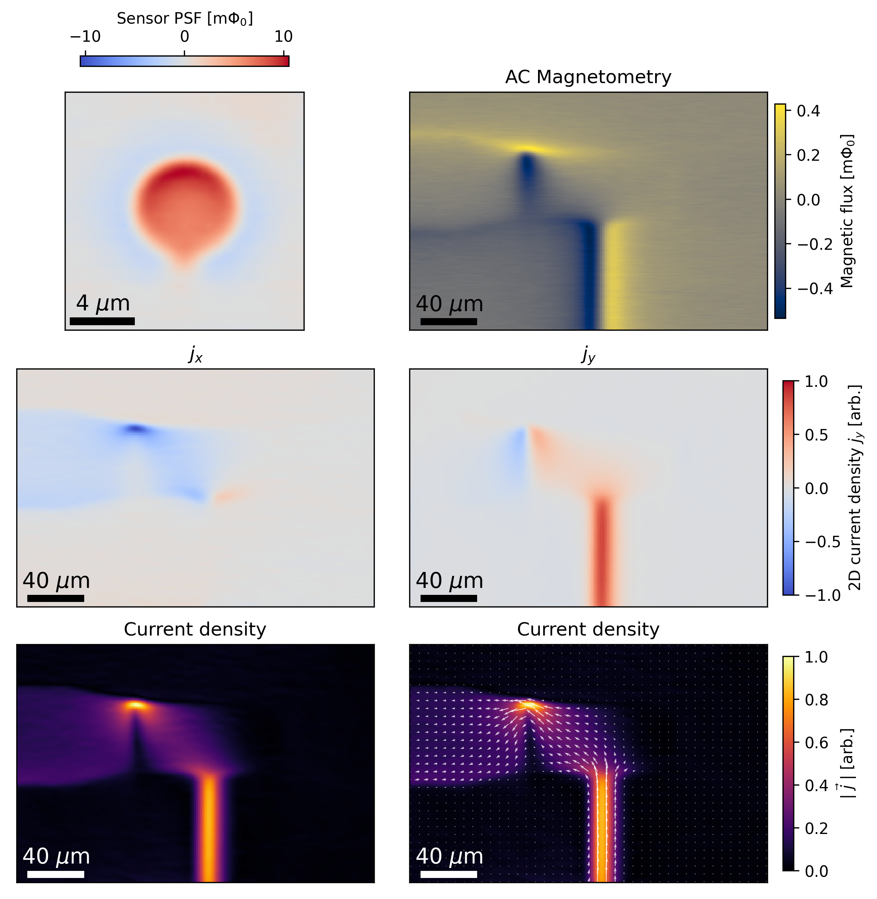

# current-reconstruction

This repo implements a Fourier transform inversion of the 2D Biot-Savart law to reconstruct a 2D current density distribution from an image of the out-of-plane magnet field B_z, or a magnetic flux signal given by B_z convolved with a magnetic
sensor's point spread function (PSF) or imaging kernel.

The method is based the following reference:
> "Using a magnetometer to image a two‐dimensional current distribution,"
> J. Appl. Phys. 65, 361–372 (1989) https://doi.org/10.1063/1.342549.

A free PDF of the paper is available at
https://www.vanderbilt.edu/lsp/documents/jap-roth-using-89.pdf.

A sample dataset from a scanning SQUID current imaging experiment is provided in `./sample_data/`. The dataset includes the point spread function of the SQUID magnetometer (`psf.npz`) obtained by imaging a small magnetic dipole oriented out of the plane. The current imaging data (`mag.npz`) was obtained by sourcing a ~600 Hz 1 µA AC current through a small device and measuring the AC flux picked up by the SQUID using a lockin amplifier. The reconstructed current density is in arbitrary units because the magnetic moment of the dipole used to calibrate the SQUID point spread function is unknown.

The `Image` class represents a magnetometry image from which to reconstruct a 2D current density. The `reconstruct_current()` function performs the Fourier transform inversion of the 2D Biot-Savart law. 

Basic usage:

```python
from current_reconstruction import Image, reconstruct_current
from current_reconstruction.test import load_psf_data, load_mag_data

psf_data = load_psf_data()
mag_data = load_mag_data()

psf = Image(
    psf_data["xs"],  # shape (m, ) array of x coordinates
    psf_data["ys"],  # shape (n, ) array of y coordinates
    psf_data["zs"],  # shape (n, m) array of values
)
mag = Image(mag_data["xs"], mag_data["ys"], mag_data["zs"])

# Sensor-sample standoff in the same units as
# psf.xs, psf.ys, mag.xs, and mag.ys
z0 = mag_data["z0"]

# Cutoff frequencies for Hanning filter.
kx_max, ky_max = 1.5, 1.5

jx, jy = reconstruct_current(mag, z0, psf=psf, kx_max=kx_max, ky_max=ky_max)
```

